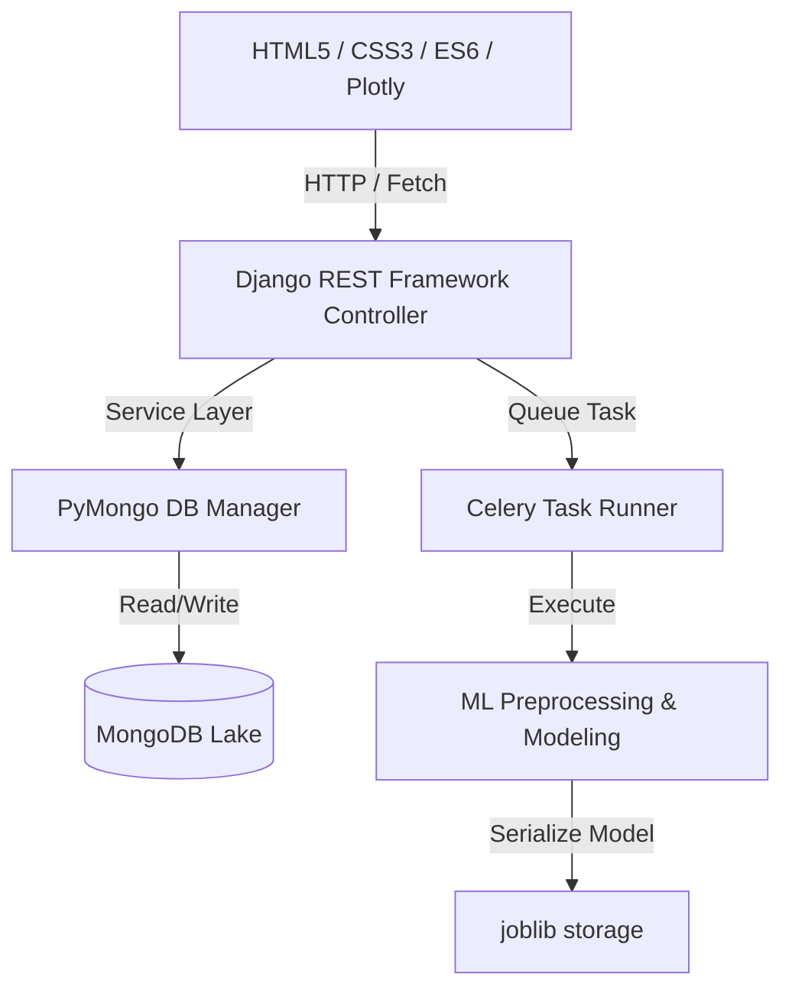

# Software Design Document (SDD) - AEDIP

## 1. Architectural Design
AEDIP adopts a clean, service-oriented architecture written in Python and JavaScript. It utilizes a hybrid database approach: SQLite is used for internal Django management while MongoDB acts as the primary data lake for all analytics, user entities, and AutoML metadata.



## 2. Database Design (MongoDB Collection Schemas)

### Users (`users` collection)
```json
{
  "_id": "ObjectId",
  "email": "string (unique index)",
  "password_hash": "string (django hashed)",
  "first_name": "string",
  "last_name": "string",
  "role": "string (admin | manager | analyst | viewer)",
  "is_verified": "boolean",
  "created_at": "date"
}
```

### Projects (`projects` collection)
```json
{
  "_id": "ObjectId",
  "name": "string",
  "description": "string",
  "owner_id": "ObjectId",
  "created_at": "date"
}
```

### Datasets (`datasets` collection)
```json
{
  "_id": "ObjectId",
  "project_id": "ObjectId",
  "filename": "string",
  "file_path": "string",
  "cleaned_file_path": "string (optional)",
  "data_quality_score": "double",
  "metadata": {
    "columns": ["string"],
    "row_count": "integer",
    "schema": {
      "column_name": {
        "dtype": "string",
        "semantic_type": "string",
        "missing_count": "integer",
        "distinct_count": "integer"
      }
    }
  }
}
```

### Models (`models` collection)
```json
{
  "_id": "ObjectId",
  "project_id": "ObjectId",
  "dataset_id": "ObjectId",
  "name": "string",
  "problem_type": "string (classification | regression)",
  "target_column": "string",
  "metrics": {
    "accuracy": "double (optional)",
    "r2_score": "double (optional)",
    "confusion_matrix": "array (optional)"
  },
  "leaderboard": [
    {
      "model_name": "string",
      "score": "double",
      "metrics": "object"
    }
  ],
  "file_path": "string",
  "feature_importance": {
    "column_name": "double"
  },
  "status": "string (completed | failed)",
  "created_at": "date"
}
```

## 3. Core Component Design

### 3.1 Preprocessing Pipeline
Implemented in `DataPreprocessor`:
1.  **Duplicate Dropping:** Drops exact duplicate rows.
2.  **Imputation:** Fills numeric missing values using medians, and categorical values using modes.
3.  **Outlier Clipping:** Fits an Isolation Forest model to flag outliers. Outliers are clipped to 1st and 99th percentiles.
4.  **Scaling and Encoding:** Standard scales numerical data and label encodes categories, returning fitted mappings for inverse operations.

### 3.2 NLP Heuristics Engine
Implemented in `NLQueryInterpreter`:
*   Uses a regex keyword-based parser to route natural language requests to specific Pandas execution pipelines.
*   Encompasses:
    *   **Maximum Region:** Groups a metric column by region and returns the top region with its contribution percentage.
    *   **Monthly Decline Drilldown:** Identifies the month with the largest MoM drop and groups segments to find the exact sub-category driving the decline.
    *   **Trend Prediction:** Fits a linear regression trend line to forecast the next monthly period with confidence boundaries.
    *   **Insight Bullets:** Computes general metrics including totals, averages, MoM changes, and missing data stats.
