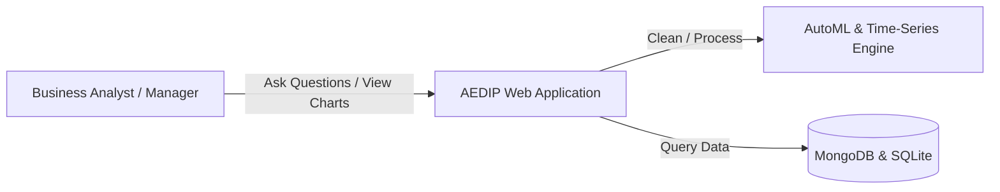

# Software Requirement Specification (SRS) - AEDIP

## 1. Introduction
This document defines the requirements for the **AI Enterprise Decision Intelligence Platform (AEDIP)**. AEDIP is a production-grade web application designed for enterprise analytics, business logic predictions, time-series forecasting, and natural language analytics.

## 2. Product Perspective & Scope
AEDIP connects to raw business datasources, cleans and profiles them, trains AutoML models, generates predictive inferences, executes conversational queries, and outputs executive PDF/PPTX briefs. It serves as a unified workspace for organizational decision-making.

## 3. User Personas & Permissions
The system enforces Role-Based Access Control (RBAC):
*   **Viewer:** Can view dashboard KPI charts, select workspaces, read reports, and browse dataset structures.
*   **Analyst:** Can upload datasets, trigger cleaning pipelines, perform automated EDA, train AutoML models, compute forecasts, and ask NLP questions.
*   **Manager:** Can manage projects, trigger PDF/PowerPoint compilations, read system-wide summaries, and view activity audits.
*   **Admin:** Complete permissions, including reading detailed system activity audit logs and adjusting system configurations.

## 4. Functional Requirements

### Module 1: Authentication & Audit Logging
*   **Req 1.1:** Secure registration, password hashing, and simulated email verification.
*   **Req 1.2:** Login issuing JWT access tokens.
*   **Req 1.3:** Session-based fallback for UI templates.
*   **Req 1.4:** Audits logging user actions, timestamps, and request IP addresses.

### Module 2: Dataset & Cleaning
*   **Req 2.1:** CSV and Excel drag-and-drop file upload.
*   **Req 2.2:** Validation, column mapping, missing value analysis, and duplicate detection.
*   **Req 2.3:** Imputation (median/modal vectors), outlier clipping (Isolation Forest), and quality index calculations.

### Module 3: AutoML Engine
*   **Req 3.1:** Auto-detect problem type (classification vs. regression).
*   **Req 3.2:** Train multiple algorithms (Random Forest, Decision Tree, XGBoost, Extra Trees, Gradient Boosting, Linear/Logistic Regression).
*   **Req 3.3:** Record metrics (Accuracy, F1, MAE, R2, Confusion Matrix, ROC curves) and rank models on a leaderboard.

### Module 4: Advanced Analytics & Conversational Queries
*   **Req 4.1:** Time-series forecasting using Holt-Winters / SARIMAX with confidence intervals.
*   **Req 4.2:** Unsupervised anomaly risk analysis using Isolation Forest and LOF.
*   **Req 4.3:** Local Natural Language Query Interpreter supporting questions regarding declines, maximum regions, low product metrics, and forecasts.

### Module 5: Report Compiling
*   **Req 5.1:** Dynamically generate professional PDF summaries with tables and paragraphs.
*   **Req 5.2:** Generate PowerPoint slideshow files with bullet lists and metric lists.

## 5. Non-Functional Requirements
*   **Performance:** UI charts render in under 1 second using cached structures.
*   **Security:** JWT verification on API routes, password hashing using Django's PBKDF2.
*   **Portability:** Runs inside standard Docker containers.
